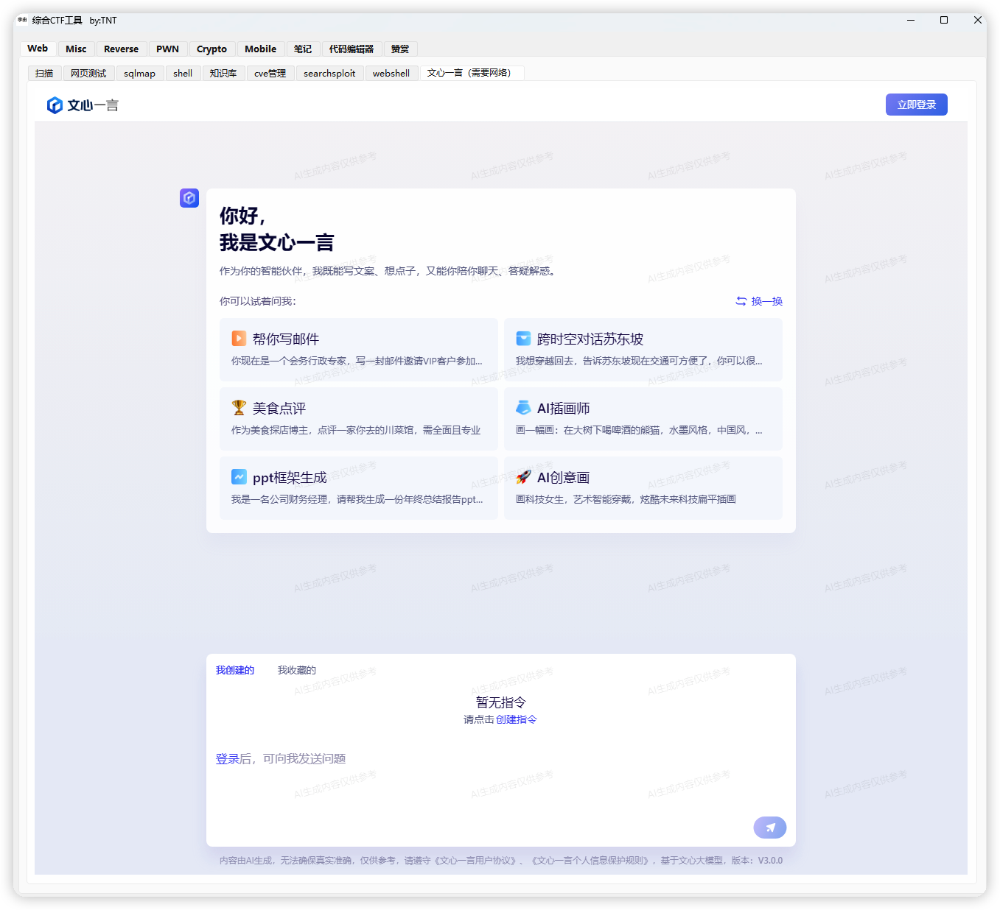
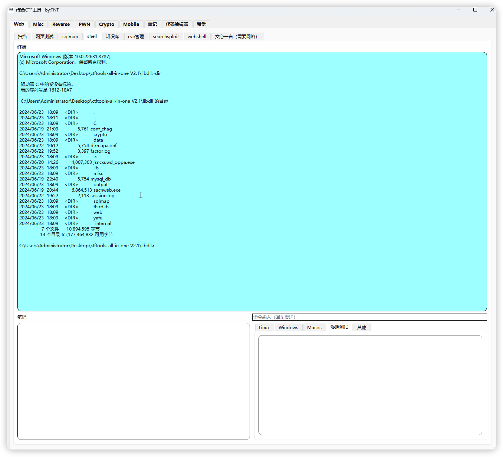
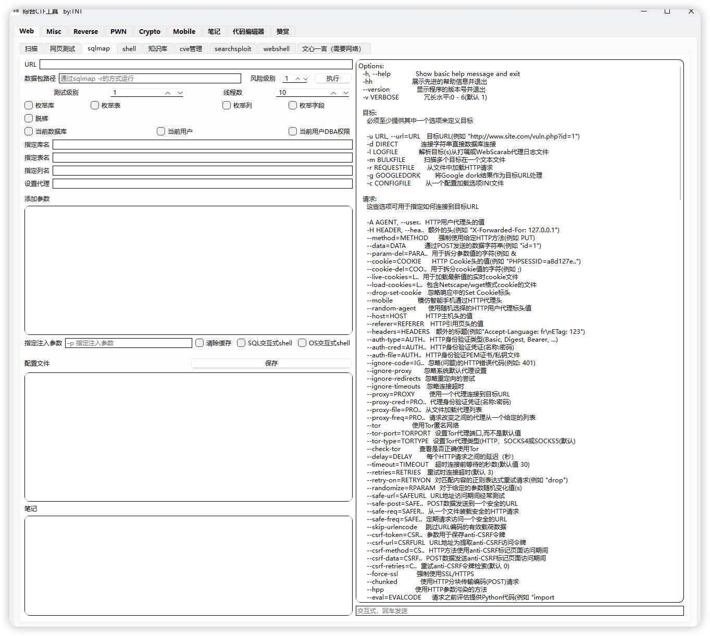
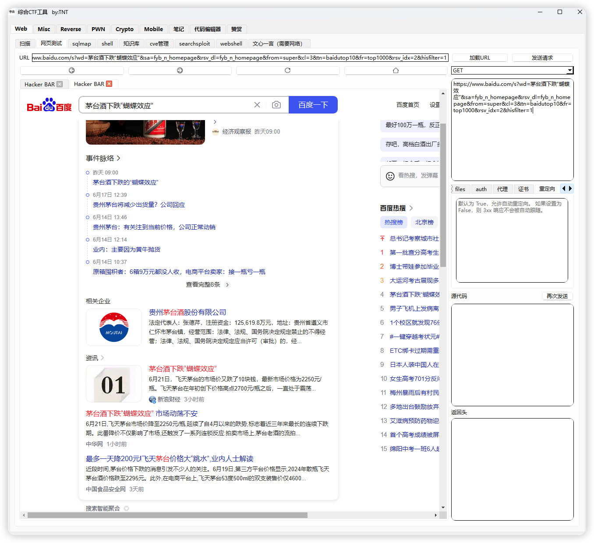

# CTF综合工具

#### 前提

這是由 [gitee.com/liyouyinjia/ctftools-all-in-one] [https://gitee.com/liyouyinjia/ctftools-all-in-one] 轉發至 github 過來，
目的讓牆內外的都能夠下載到本程式。方案归 @liyouyinjia 及 参与贡献者拥有。

#### 介绍
随着网络安全领域的不断发展，网络安全竞赛（Capture The Flag，简称CTF）已经成为衡量网络安全人才技能水平的重要平台。CTF竞赛不仅要求参赛者具备深厚的网络安全理论知识，还需要他们具备快速应对各种网络攻击和漏洞利用场景的实际操作能力。然而，在实际的CTF竞赛过程中，参赛者往往会遇到多个问题，如信息收集、漏洞利用、提权、文件传输等，这些过程往往涉及到多个工具的使用和复杂的操作流程。

目前，市场上虽然存在大量的网络安全工具和软件，但它们大多针对某一特定领域或功能，缺乏一个统一的、集成的、易于使用的综合工具平台。这导致参赛者在CTF竞赛中需要频繁切换不同的工具，不仅降低了工作效率，还增加了操作失误的风险。

因此，研发一款CTF综合工具平台具有重要的现实意义和应用价值。该工具平台能够集成多个常用的网络安全工具，并提供一个统一的用户界面和操作界面，使得参赛者可以在一个平台上完成信息收集、漏洞利用、提权、文件传输等操作。
#### 软件架构
软件采用C和python

#### 使用说明
 **默认采用GPU加速（速度快，用显存），如果只用CPU的话内存占用会多点，然后cpu的运算模式肯定速度会慢一点，如果在VM虚拟机上运行会存在无法调用GPU的情况** 

声明：仅面向合法授权的企业安全建设行为，如您需要测试本工具的可用性，请自行搭建靶机环境

#### 参与贡献

1.  TNT
2.  dirmap
3.  风二西
4.  gogo
5.  chi11i
6.  无名

